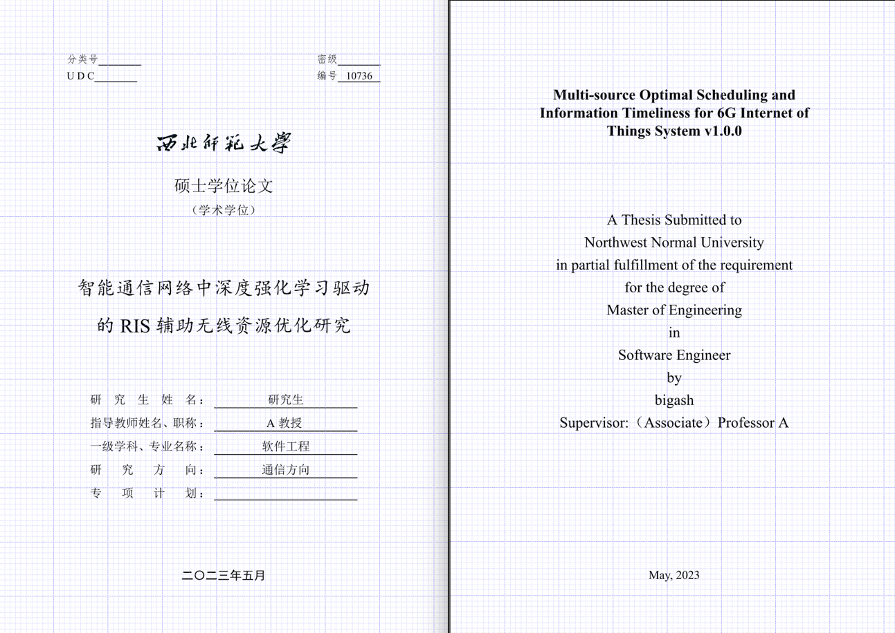
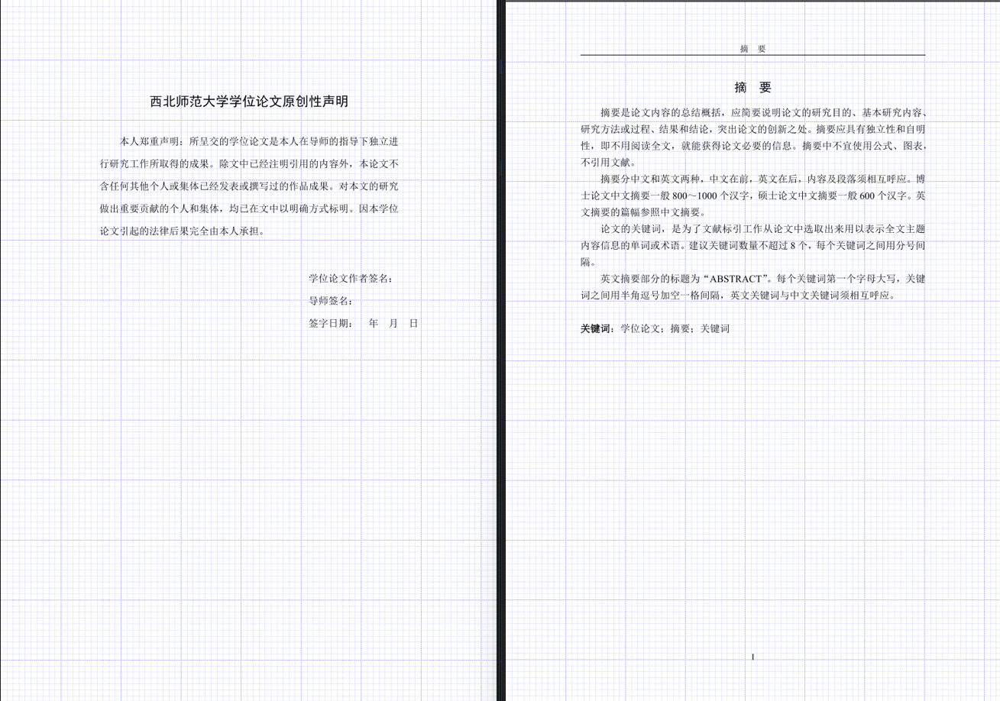
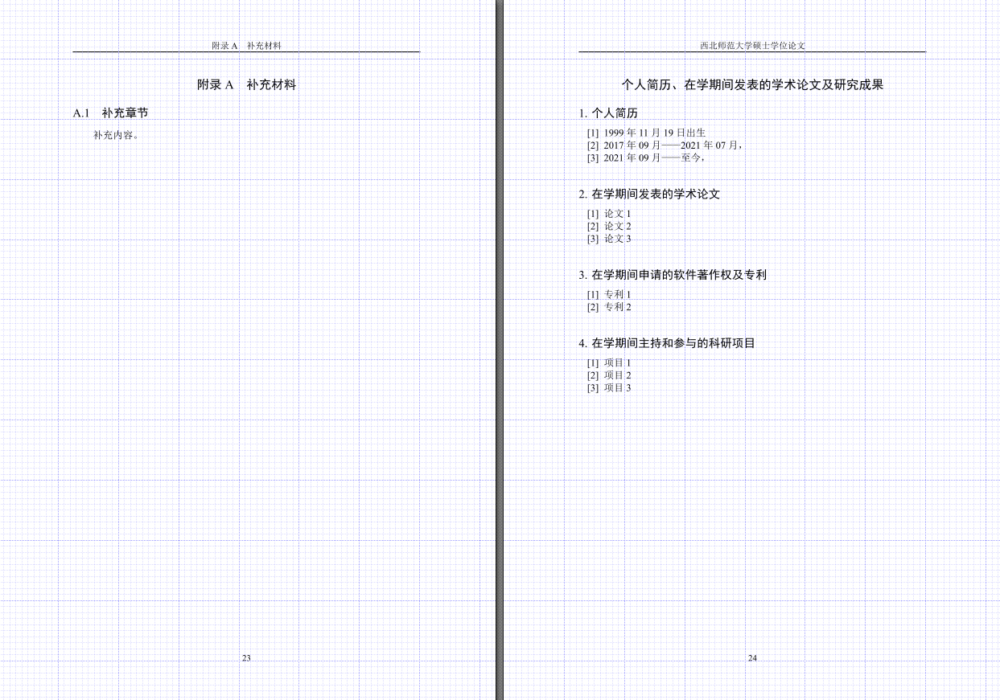

# NWNU-dissertation

本模板是西北师范大学计算机科学与工程学院研究生学位论文 LaTeX 模板，按照《[计算机科学与工程学院研究生学位论文模板(2023版)](https://jsj.nwnu.edu.cn/2454/list.ht)》的要求编写。

LaTeX template for master's thesis of the College of Computer Science and Engineering, Northwest Normal University

## 部分预览

## 模板特点

- 模板同时支持学硕以及专硕选择，支持双面打印。

## 如何使用

推荐使用Windows，建议编译直接用VScode现成插件LaTex Workshop，前提需要简单的配置。

以下是文件目录说明：

| 文件/目录                     | 描述                             |
|------------------------------|----------------------------------|
| `chapters/*.tex`             | 模板论文的各个章节                 |
| `bib/`                       | 参考文献以及格式存放            |
| `figures/`                   | 放置图片的目录                   |
| `NWNU-dissertation-doc.pdf`  | 模板使用说明（PDF 文档）         |
| `main.tex`                   | 模板文件主文档                |
| `ashsetup.tex`               | 模板的配置文件                   |
| `chapters/*.tex`             | 示例文档的各个章节               |
| `README.md`                  | 基本说明                         |
| `latexmkrc`                  | latexmk 的配置文件               |

建议使用前阅读``模板使用说明（PDF 文档）``

